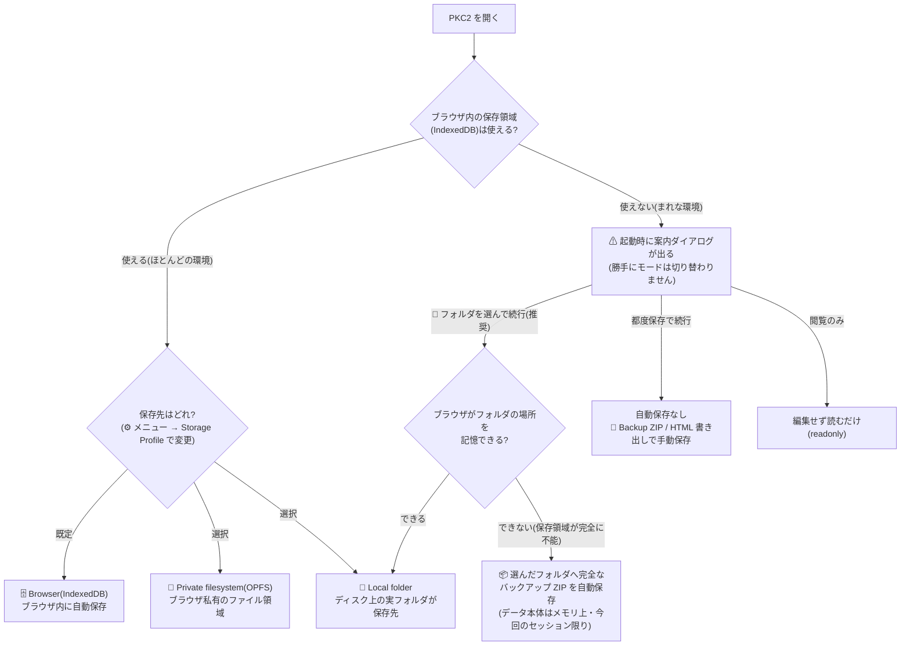
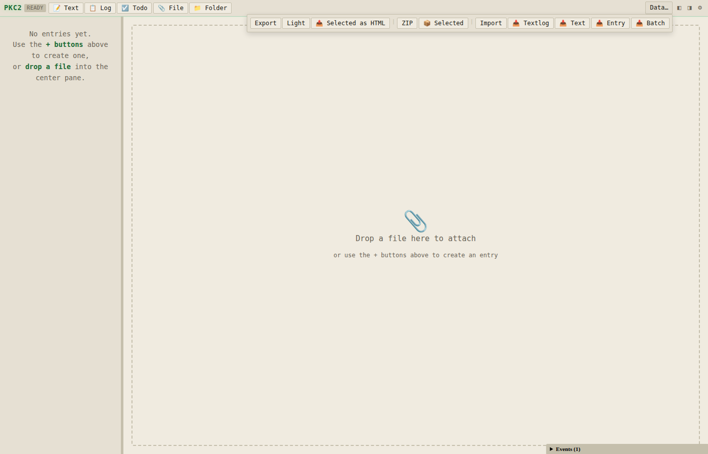

# 保存と持ち出し

PKC2 のデータがどこに保存され、どうやって持ち出せるかを説明します。詳しい Export / Import / Rehydrate の手順は次章を参照してください。

## まず結論 — おすすめの組み合わせ

長い説明を読む前に、これだけ覚えれば十分です。組み合わせは「保存先（どこに置くか）× 保存形式（どう書くか）」で決まります。

| おすすめ度 | 組み合わせ | こんな人・状況 |
|---|---|---|
| ✅ **最もおすすめ（既定のまま）** | **Browser（IndexedDB）× 従来形式** | ほぼ全員。全操作で最速・設定不要・実績も最長。あとは定期的に 💾 Backup ZIP を取るだけで十分です |
| ⛔ ~~データが大きく、保存領域が足りないとき~~ | ~~**省容量形式**（`lazy_entry_bodies`）~~ | **2026-07-26 に提供を終了しました**（約 3 ヶ月後に廃止）。新たにオンにはできません。オンにしていた場合は、**次にデータを保存した時点で自動的に従来形式へ戻ります**（操作不要）。詳細は本章の「省容量形式 ── 提供を終了しました」を参照 |
| 🔧 **要件があるときだけ** | **Local folder または OPFS × 従来形式** | 実フォルダにファイルとして置きたい（他ツールと共有・自前バックアップ運用）→ Local folder。ブラウザの自動削除（eviction）への耐性が欲しい → OPFS。**速度目的では選ばない**でください（速度は IndexedDB が最速です） |
| ⛔ ~~編集がとても多く、書き込み量を減らしたいとき~~ | ~~**差分保存**（`differential_save`）~~ | **2026-07-26 に提供を終了しました**。新たにオンにはできません。オンにしていた場合は、**次にアプリを開いた時点で自動的に従来形式へ移行します**（操作不要）。詳細は本章の「差分保存 ── 提供を終了しました」を参照 |
| ⚠️ **推奨しない（特殊なケースのみ）** | OneDrive 等の**同期フォルダ**を Local folder に指定 | 保存のたびに同期・ウイルススキャンが走って重くなります |

なお、ブラウザの保存領域が使えない環境向けのフォールバック（フォルダへの ZIP 自動保存・都度保存・閲覧のみ）は**自分で選ぶ組み合わせではなく**、該当環境でだけ起動時に自動で案内されます（本章後半で説明）。

## データの保存場所 — 全体像

PKC2 は変更を自動保存します。**どこに保存するか（保存先）は 3 つから選べ、既定はブラウザ内の IndexedDB** です。さらに、ブラウザの保存領域がそもそも使えない環境では、起動時に案内ダイアログが出て「ファイルへ保存する方式」を選べます。

まず全体像を 1 枚で示します。

> この図は GitHub 上でも PKC2 内でもそのまま図として表示されます（mermaid 描画は既定で有効。ブロック右上の `‹/›` ボタンでコード表示に切り替えられます。詳細は [12 章 §12.7.4](./12_マークダウン拡張記法.md) の標準規約）。

### 保存のかたちは 2 種類ある

図の中には性質の違う 2 つの「フォルダ保存」が出てきます。混同しやすいので先に区別します。

| | 📂 Local folder（保存先） | 📦 フォルダへの ZIP 自動保存（非常用） |
|---|---|---|
| なにを置く? | データ本体（レコード単位のファイル群） | 完全なバックアップ ZIP を 1 個 |
| いつ使う? | 通常環境で、実フォルダに置きたいとき | ブラウザの保存領域が**完全に使えない**環境の救済 |
| 次回起動 | フォルダに再接続すれば続きから | ダイアログでフォルダを選び直し、ZIP を Import して再開 |
| どこから入る? | ⚙ メニュー → Storage Profile | 起動時の案内ダイアログのみ |

つまり通常の「保存先の変更」（次節の Storage Profile）は**コンテナの置き場所を移す**操作で、非常用の ZIP 自動保存は**置き場所がない環境でバックアップを置き続ける**運用です。

### 保存先に共通する注意

- **ブラウザごと・URL ごと**: Chrome で開いた PKC2 のデータは、同じ Chrome の同じ HTML ファイル URL からしか読み書きできません。`file:///` と `https://` でも別のストレージになります（Local folder は実フォルダなのでこの制約を受けません）
- **ストレージのクリアで消える**: ブラウザの「サイトデータを削除」「履歴を削除」で IndexedDB / OPFS のデータは消える可能性があります
- どの保存先でも、**従来の書き出し形式（単一 HTML）と Backup ZIP はそのまま読み書きできます**（互換保証）。保存先を移るときは PKC2 が非破壊で移行し、移行の前には ZIP バックアップを自動作成します

重要なデータは保存先によらず、定期的に Export（特に Backup ZIP）でバックアップしてください。

## ストレージ構成

保存先の内部で PKC2 は次の 3 つの領域を使います。

- **containers** — エントリ・リレーション・リビジョンなどのメタデータ
- **assets** — ファイル添付の実体（base64 形式）
- **segments** — 省容量形式（**2026-07-26 に提供終了**、後述）が使っていた分割データ。従来形式へ戻ると自動的に回収されます

この分離のおかげで、添付ファイルを多用してもメタデータの読み書きは速いままです。

## 自動保存のタイミング

- 編集確定の **約 300 ミリ秒後** に IndexedDB へ書き込み
- 連続した変更はデバウンスされ、1 回の保存にまとめられます
- ブラウザタブを閉じるときに未保存の変更があれば、`pagehide` イベントで強制保存

手動保存のボタンはありません。変更したら、何もしなくてもディスクに残ります。

## HTML を開いたときの起動元

PKC2 の HTML を開くと、PKC2 は次の 2 つのデータ源のどちらから起動するかを決めます。

- **埋め込みコンテナ（pkc-data）** — HTML 内部に同梱された Container（Export 時点のスナップショット）
- **IndexedDB** — そのブラウザに保存済みのワークスペース

判定ルールは次のとおりです。

| 状況 | 起動元 | IndexedDB への保存 |
|------|--------|------------------|
| 空の HTML（`pkc2.html`）を開く・IDB あり | IndexedDB | 通常どおり保存される |
| 空の HTML を開く・IDB なし（初回） | 空の Container | 最初の編集から保存される |
| Export HTML を開く・IDB なし | 埋め込みコンテナ | **保存されない（view-only）** |
| Export HTML を開く・IDB あり | **起動元を選ぶダイアログが出る** | 選択次第 |

### 起動元を選ぶダイアログ（chooser）

埋め込みコンテナと IndexedDB の両方が見つかると、起動時にどちらを開くかを尋ねるダイアログが表示されます。

- **埋め込みを開く (view-only)** — HTML 内の Container を表示。編集しても IDB には保存されません（リロードで消えます）
- **IndexedDB を開く** — 通常のワークスペースとして起動。編集は自動保存されます

このダイアログは Escape や背景クリックでは閉じません。必ずどちらかを選んでください。

### View-only モードの意味

埋め込みコンテナから起動した場合、**そのセッション中の編集は IndexedDB に書き込まれません**。これは「Export を見るだけで受信者の普段のワークスペースが上書きされる」事故を防ぐための仕様です。

- 見るだけ: そのまま閲覧・検索してください。タブを閉じれば何も残りません
- 編集して残したい: 後述の **Import** 操作を経由してください。Import を確定した時点で IDB に保存されます
- Readonly HTML の場合: view-only の上に readonly UI もかぶるため編集ボタン自体が出ません。編集したい場合は **Rehydrate** を使ってください

iframe として埋め込まれて動いている PKC2 は、ダイアログを出さず常に埋め込みコンテナ側から起動します（埋め込み用途では受信者のワークスペースを触らない方が自然なため）。

## データを持ち出す方法

画面右上の **Data…** を押すと、Export / Import のボタン群が展開されます。`|` で区切られた 3 つのグループがあり、左から **Share**（HTML で共有・配布）・**Archive**（Backup ZIP と単体バンドル）・**Import**（取り込み）です。

PKC2 の Export は **範囲** と **形式** の 2 軸で選べます。

### 範囲（何を持ち出すか）

| 範囲 | 内容 |
|------|------|
| **全体（Workspace 全体）** | Container にあるすべてのエントリ・添付・履歴・関連 |
| **フォルダスコープ** | 指定フォルダの配下にあるエントリとそれに紐づく添付 |
| **Selected-only（単独エントリ）** | 選択中のエントリ 1 件だけ + その参照する添付 |

### 形式（どう入れるか）

| 形式 | 特徴 | サイズ感 |
|------|------|----------|
| **HTML Light** | 本文・構造のみ。添付ファイル実体は同梱しない | 数十 KB |
| **HTML Full** | 全データ含む。gzip 圧縮で自己完結 | 数 MB〜 |
| **Backup ZIP**（`.pkc2.zip`） | 添付を生バイナリで保存する PKC2 専用 ZIP。バックアップ・別 PKC2 への再インポート用 | 最もサイズ効率が良い |
| **単体バンドル**（`.text.zip` / `.textlog.zip`） | 単独エントリの可搬形式（旧称: ZIP Package の一形態） | 小さい |
| **一括バンドル**（`.texts.zip` / `.textlogs.zip` / `.mixed.zip` / `.folder-export.zip`） | archetype filter 付きの container 一括 ZIP / フォルダ配下 ZIP | 中規模 |

> 用語メモ: 旧 manual の **「ZIP Package」** は、現在は **Backup ZIP** と **単体バンドル / 一括バンドル** の 2 系統に分けて呼びます。実体・拡張子・互換性は不変で、呼称のみの整理です。

> 未実装の項目: **Interchange ZIP / File Tree ZIP**（普通のフォルダで人間可読に展開できる future format、`.pkc2-tree.zip`）は v2.2+ で検討中です。本マニュアル時点では存在しません。詳細は `docs/development/import-export-surface-audit.md` §9 を参照。

### 組み合わせの目安

- **仲間にドキュメントだけ見せたい** → 全体 × HTML Light（軽量、添付なし）
- **配布可能な完成版にしたい** → 全体 × HTML Full × Readonly（閲覧専用、改変防止の意思表示）
- **マシン移行 / 完全バックアップ** → 全体 × **Backup ZIP**（最もロスなし、Git 管理にも向く）
- **プロジェクト単位で渡したい** → フォルダスコープ × HTML Full か 一括バンドル
- **1 件のメモを別ワークスペースに移したい** → Selected-only × **単体バンドル**

### Editable / Readonly の選び方（HTML の場合）

HTML Export には **Editable** と **Readonly** のモードがあります。

- **Editable** — 開いたらそのまま編集できる（自分用バックアップ、マシン移行向け）
- **Readonly** — 閲覧専用 UI。**Rehydrate** ボタンで編集可能ワークスペースに昇格できる（配布向け、うっかり編集防止）

Readonly はあくまで UI ポリシーであり、HTML ソース編集などの手段で回避はできます。セキュリティ保護ではなく「誤改変を防ぐ」ガードとして使ってください。

## データを読み込む方法

Data パネル右側の Import グループから、取り込み方を選びます。ボタンを押すとブラウザのファイル選択ダイアログが開きます（PKC2 独自のダイアログではなく、OS 標準のものです）。

- **Import（Replace / Merge 選択）** — ワークスペースで **Import** ボタンを押し、`.html` または **Backup ZIP**（`.pkc2.zip`）を選択。プレビュー画面で **Replace**（全置換）か **Merge**（追加取り込み）を切り替えられます。Merge では同名 entry が衝突すると conflict 解決 UI が出ます（後述）
- **Batch Import（追加）** — 一括バンドル（`.textlogs.zip` / `.texts.zip` / `.mixed.zip` / `.folder-export.zip`）または素のテキスト / Markdown ファイル群を追加で取り込みます。既存エントリは消えません
- **単体バンドルの読み込み（追加）** — `.text.zip` / `.textlog.zip` を 1 件読み込むと、1 件の TEXT / TEXTLOG + 参照していた添付が追加されます。**📥 Entry** ボタンは拡張子を自動判別します
- **Rehydrate** — Readonly HTML を直接開いている状態で **Rehydrate to Workspace** ボタンを押す。新しい Container ID が発行され、編集可能ワークスペースとして IndexedDB に保存されます

### Import 確認ダイアログ

通常 Import はまず **プレビュー** を表示します。件数やタイトルを確認したうえで **Confirm Import** を押すと置換が実行されます。途中で **Cancel Import** を押せば現在のデータには何も変更がかかりません。

プレビュー内の上部ラジオで **Replace**（全置換）か **Merge**（追加取り込み）を切り替えられます。Replace が既定です。

### Merge mode と conflict 解決 UI

**Merge** を選ぶと、既存データを保持したまま imported 側の entry を追加取り込みします。同じ archetype・同じタイトルの entry が host と imported の双方に存在すると、プレビュー中段に **Entry conflicts** セクションが現れ、1 件ずつ処理方針を決めてから Confirm merge を押す流れになります。

#### Conflict UI が出る条件

- Import mode を **Merge** に切り替えている
- host と imported の schema version が一致している
- 同じ archetype + 正規化後タイトルが一致する entry が 1 組以上ある

いずれかが欠けていると conflict セクションは出ません。Replace を選んでいる／schema が違う／衝突が 0 件、のいずれでもそのまま従来どおりに進みます。

#### 3 つの分類

| 分類 | 説明 |
|------|------|
| **C1（content identical）** | archetype・タイトル・本文内容ハッシュがすべて一致。実質的に同じ entry |
| **C2（title matches, content differs）** | タイトルは同じだが本文が違う。host 側の候補は 1 件 |
| **C2-multi（N host candidates）** | タイトルは同じだが本文が違い、host 側に候補が 2 件以上ある（曖昧） |

タイトル比較は Unicode NFC 正規化 + 前後空白除去 + 連続空白の単一スペース化で行われます。大文字小文字は区別します。内容ハッシュは本文と archetype だけを入力にしています（title は分類軸なのでハッシュに含めません）。

#### 選べる操作（各 conflict 行のラジオ）

- **Keep current**（現状維持） — host 側を残し、imported 側は取り込みません。C1 では既定で選択済み。**C2-multi では選べません**（どの host を残すか曖昧なため disabled）
- **Duplicate as branch**（分岐として追加） — imported 側を新しい lid で追加し、host とは別 entry として並存させます。provenance（由来）リレーションが自動で 1 件付与され、「どの host から派生したか」を後から追跡できます
- **Skip**（取り込まない） — imported 側を取り込みません。container に残る結果は Keep current と同じですが、イベントログ上で「skip された」として別計上されます

#### 一括設定ボタン

conflict セクション下部のショートカットで、複数件をまとめて設定できます。

- **Accept all host** — 全 conflict を Keep current に一括設定。C2-multi 行は対象外（既存の選択があれば保持されます）
- **Duplicate all** — 全 conflict を Duplicate as branch に一括設定（C1 / C2 / C2-multi すべてに適用）

#### Confirm merge が押せない条件

Confirm merge は、以下をすべて満たすまでグレーアウトします。

- C2 行すべてにラジオが選択されている
- C2-multi 行すべてにラジオが選択されている（Keep current 以外）
- C1 は既定の Keep current のままで OK

未解決がある間はボタン近傍に `Resolve N pending conflicts` と残件数が出ます。0 件になると Confirm merge が押せるようになります。

#### Cancel / Replace 切替 / 再プレビュー

- Cancel merge を押すと conflict 行の選択状態は破棄されます
- Replace に切り替えても破棄されます
- 別ファイルで再プレビューしたときも引き継ぎません（新規プレビューごとに判断し直す設計）

#### v1 の非対象

以下は v1 では提供しません（意図的）。

- **semantic merge** — field 単位の cherry-pick、markdown AST diff
- **attachment の binary diff** — 添付バイナリの差分表示・マージ
- **textlog のログ行単位 merge** — ログ行ごとに採否を選ぶ special-case merge
- **global auto-resolution policy** — 「今後も同じように扱う」などの永続ルール登録
- 3-way merge（common ancestor との比較）／ revision の持ち込み・比較

conflict の意思決定は 1 プレビューセッション限りで、次回の Import では改めて選択し直します。

### View-only コンテナを IndexedDB に取り込む

埋め込みコンテナから起動した（view-only）状態で編集を保存したい場合は、次の手順で明示的に取り込みます。

1. 現在の HTML をブラウザの標準機能（`Ctrl+S` / 右クリック→保存）でファイル保存
2. **Import** ボタンからそのファイルを選ぶ
3. プレビューを確認して **Confirm Import** を押す

Import 確定後は通常のワークスペースとして IndexedDB に保存され、以降の編集は自動保存されます。見るだけと取り込むを明確に分けるための設計で、「見る」で保存が始まることはありません。

## ZIP Import の警告（成功したが注意事項あり）

ZIP (`.pkc2.zip`) を Import したとき、中身に次のような不整合があると **import は成功したうえで警告 toast が表示されます**。

- 同じ asset key が 2 回以上含まれていた（内容が同一 → 重複排除された / 内容が異なる → 最初の 1 件だけ残された）
- `manifest.json` または `container.json` が 2 個以上入っていた（最初の 1 件が採用された）
- パス区切りや `..` を含む危険な asset key が含まれていた（その asset はスキップされた）

toast は「警告」色で表示されますが、**import 自体は失敗していません**。Container の preview は通常どおり出るので、そのまま進めて問題ありません。

より細かい診断情報は **ブラウザのデベロッパーツール（F12）のコンソール** に 1 件ずつ出力されます。`[PKC2] ZIP import warning: ...` の行を確認すると、どの asset key でどんな問題があったかが分かります。

### よくあるパターン

| toast の内容 | 意味 |
|--------------|------|
| "Duplicate asset key ... with identical content — deduplicated" | 同じバイナリが 2 回入っていた。害はなく、1 件に整理されました |
| "Asset key ... had conflicting contents — kept the first occurrence" | 同じ key で中身が異なる asset が入っていた。最初のものだけ採用しています |
| "ZIP contained multiple manifest.json entries — kept the first" | 異常な ZIP 構造。通常は問題ないが、出どころに心当たりがなければ元ファイルを再確認 |
| "Skipped asset with unsafe key ..." | パス不正の key は読み込みません。該当の asset は存在しない扱いになります |

## バックアップの推奨

- **日常のバックアップ**: 月 1 回など定期的に **Backup ZIP**（`.pkc2.zip`）として書き出し、別のストレージ（USB メモリ、クラウドドライブなど）に保存
- **重要な編集前**: Import で大量置換する前は必ず事前に Export しておく
- **マシン移行前**: **Backup ZIP** が最もロスなく移行できます（添付の base64 膨張がない）

## 保存先の切替と作業コンテナの切替（Storage Profile）

メニュー → **📊 Storage Profile** から、保存先（ストレージバックエンド）と作業コンテナを切り替えられます。

### ストレージバックエンドの切替

「Storage backend」で保存先を選べます（切替時はアプリが再読み込みされ、データは**非破壊で移行**＝元の保存先にもコピーが残ります）。

- **🗄 Browser (IndexedDB)** — 既定。ブラウザ内のローカル DB。
- **📁 Private filesystem (OPFS)** — ブラウザ専用のプライベートファイルシステム。`https` / `localhost` でのみ利用可（`file://` では使えず Browser に自動フォールバック）。
- **📂 Local folder** — ディスク上の**実フォルダ**を選んで保存先にします（対応ブラウザ＝Chromium 系）。選択時にフォルダのアクセス許可を求められます。**切替の直前に、移行前バックアップ ZIP が移行先フォルダへ自動作成されます**（バックアップに失敗した場合は切替自体を中止します — 2026-07 安全策）。

> **フォルダへの再接続（2026-07 改善）**: ブラウザを閉じるとフォルダの許可は「要確認」状態に戻るため、次の起動ではフォルダを直接開けません。以前は**何も言わずに別データ（ブラウザ内 DB）で開いてしまい、「新規コンテナで開いた」ように見える**問題がありました。現在は画面上部に**「フォルダ○○への再接続が必要です」バナー**が出ます — **「🔓 フォルダに再接続」を押して許可**すると、自動で再読み込みされてフォルダの内容が開きます。バナーを閉じて続行した場合、その編集はフォルダには保存されません（別データ）のでご注意ください。
>
> なお **OneDrive など同期フォルダを保存先にすると、保存のたびに同期とウイルススキャンが走って重くなります**。常用の保存先は Browser（IndexedDB）/ OPFS にし、同期したいものは Export（単一 HTML）で置くのがおすすめです。

#### どれを選ぶか（使い分けの目安、2026-07 実測ベンチより）

| こんな使い方 | おすすめ | 理由 |
|---|---|---|
| ブラウザで常用・迷ったらこれ（既定） | **Browser (IndexedDB)** | 全操作で最速。設定不要 |
| 画像・添付ファイルが多い | **Browser (IndexedDB)** | 小さなデータの多数書込みが約 5 倍速い |
| 大容量・ブラウザの自動削除（eviction）への耐性・プロファイルと分離したい | **Private filesystem (OPFS)** | origin 専用の私有ファイルシステム。体感速度差はほぼ出ません |
| 実フォルダに置きたい（他ツールと共有 / クラウド同期 / ファイルとしてバックアップ） | **Local folder** | 実ファイルとして見える唯一のモード。速度は保存先ディスク依存 |

体感（起動時間）はどのモードでもほぼ同じです。**速度だけなら IndexedDB、置き場所や可搬性の要件があるときだけ OPFS / Local folder** と覚えてください。

#### 差分保存 ── ⛔ **提供を終了しました**

> 🔴 **2026-07-26: この形式の提供を終了しました。**
>
> - **新たにオンにすることはできません。** Flags Inspector の一覧からも外れ、URL や設定ファイルから指定しても有効になりません
> - **すでにオンにしていた場合、次にアプリを開いた時点で自動的に従来形式へ移行します。** エントリ・本文・関連・編集履歴・添付はすべてそのまま引き継がれます。お手元で何かする必要はありません
> - 移行は 1 回だけです。移行後の起動は、これまでどおり何も書き込みません

`persistence.differential_save` は、自動保存で「コンテナ丸ごと」ではなく「**変更したエントリだけ**」を書き込む設定でした。編集のたびの書込コストがコンテナの大きさによらず一定になる、という利点がありました。

##### なぜやめるのか

理由は速度ではなく **データの安全性**です。

差分保存は、コンテナを複数のレコードに分けて保存します。2026-07-26 の改善で「エントリ同士の関連」と「並び順の一覧」も別レコードへ移したのですが、**この分割を知らない古い版の PKC2 には、それらを読み戻す処理がありません**。その結果:

- 差分保存で保存したデータを**古い `pkc2.html` で開くと、エントリ同士の「関連」が 0 件に見えます**
- **その状態で保存すると、関連が実際に消えます**
- 編集履歴の並び順も失われます（同じ時刻の履歴の前後関係の判定に使っている情報です）

PKC2 は 1 つの HTML ファイルで完結する設計なので、**古い `pkc2.html` を手元に残して開く**使い方が実際にありえます。この危険を残したままにはできないと判断し、提供を終了しました。

なお、以前から知られていた「起動が遅くなり得る」問題も残っていました。2026-07-22 に一度既定オンにしましたが、**同日に撤回**しています: 保存データを小さなレコードに分割するため、**読み出し（起動）が数千レコードの分散読みになり、遅いストレージ × 大きなコンテナでは起動が極端に遅くなります**（実測で 5.5〜6.0 倍）。

##### 移行の代償 ── 書き込み量は増えます

正直にお伝えします。差分保存の利点（編集のたびの書き込み量が小さい）は、移行によって失われます。

実測（5000 エントリ・履歴 15000 件・関連 3074 件）で、**1 編集あたりの書き込み量は 11KB → 25.7MB** になります。

ただし:

- 書き込みは画面の描画とは別のところで行われるため、**操作の体感は変わりません**（増えるのは保存領域とディスクの消耗です）
- もともと既定オフで、本マニュアルでも推奨していない設定でした
- 失われるのが**復旧できないデータ**である以上、書き込み量とは釣り合わないと判断しました

##### すでに使っていた方へ

**特別な操作は不要です。** 次にアプリを開いた時点で移行が終わります。

念のため、**💾 Backup ZIP** を取っておくことをおすすめします。

#### 省容量形式（セグメント保存）── ⛔ **提供を終了しました**

> 🔴 **2026-07-26: この形式の提供を終了しました。約 3 ヶ月後に廃止します。**
>
> - **新たにオンにすることはできません。** Flags Inspector の一覧からも外れ、URL や設定ファイルから指定しても有効になりません
> - **すでにオンにしていた場合、次にデータを保存した時点で自動的に従来形式へ戻ります。** 本文・履歴・添付はそのまま引き継がれます。お手元で何かする必要はありません
> - 万一、本文を読み出せない状態のときは**書き戻しを行わず、元のデータをそのまま保持します**（空で上書きしないための安全策）

##### なぜやめるのか

当初は「高速起動形式」として提供し、2026-07-25 に実測から「省容量形式」へ改称しました。その後さらに測り直した結果、**残った利点は書き込み量の削減だけ**で、起動については**そもそも比較が成立していなかった**ことが分かりました。

- この形式は起動を「本文を 1 件も読まない状態」で完了とみなし、そのあと裏で少しずつ読み込みます（15000 エントリなら収束まで 1 分半ほど）。つまり従来形式と**同じ状態まで**を比べていませんでした
- 起動時に履歴だけは全部展開します。実測したデータでは、**展開する履歴の量が、節約する本文の 3.7 倍**ありました
- 一方で、この形式まわりに不具合が集中していました（2026-07-26 に 3 件修正 ── バックアップから添付が丸ごと落ちる／圧縮履歴の読み出し失敗で履歴が消える／書き戻しで本文が空になりうる）
- 同じ日に「起動のたびにデータ全体を保存し直していた」問題を**この形式と無関係に**修正したため、相対的な利点もさらに小さくなりました

##### すでに使っていた方へ

**特別な操作は不要です。** アプリを開いて、いつもどおり何か 1 つ編集して保存すれば、その時点で従来形式に戻ります。

念のため、戻す前に **💾 Backup ZIP** を取っておくことをおすすめします。なお、2026-07-26 より前に取ったバックアップ ZIP は、**この形式をお使いだった場合、添付ファイルが含まれていない可能性があります**（同日修正した不具合です）。お手元のバックアップをご確認のうえ、取り直してください。

| 形式 | 既定 | 効くのは | 何が変わる |
|---|---|---|---|
| 従来（単一形式） | ✅ オン | すべての保存先 | — |
| ~~差分保存 `differential_save`~~ | ⛔ **提供終了** | — | **2026-07-26 に提供終了**。新たにオンにはできません。オンだった場合は次にアプリを開いた時点で自動的に従来形式へ移行します |
| ~~省容量形式 `lazy_entry_bodies`~~ | ⛔ **提供終了** | — | **2026-07-26 に提供終了**（約 3 ヶ月後に廃止）。新たにオンにはできません。オンだった場合は次の保存で自動的に従来形式へ戻ります |

### ワークスペースと作業コンテナの切替

同一オリジン（同じ URL）の中で、**ワークスペース**（複数コンテナを束ねた作業空間）と、その中の**コンテナ**を切り替えられます。現在のものには ● が付きます。

**Workspaces**（複数のコンテナを束ねる作業空間。用途別＝仕事／私用などに分けられます）

- **Switch** — そのワークスペースに切り替え（再読み込み）
- **+ New workspace** — 空のコンテナを 1 つ持つ新しいワークスペースを作成して切り替え（名前を尋ねられます）
- **Rename** — ワークスペース名を変更

**Containers (this origin)**（**選択中のワークスペース**に属するコンテナの一覧）

- **Switch** — そのコンテナに切り替え（再読み込み）
- **+ New container** — 空のコンテナを現在のワークスペースに追加して切り替え
- **Delete** — そのコンテナを削除（取り消せません。現在のコンテナは削除できません）

各コンテナは独立した作業空間で、持ち出し（Export / 共有）はコンテナ単位なのは従来どおりです。初めて使うときは既存データが自動で「Default」ワークスペースにまとめられます（非破壊）。

## ブラウザの保存領域が使えない環境では

企業ポリシーや特殊なブラウザ設定で、**IndexedDB / localStorage が使えない・毎回初期化される**環境があります。この環境で PKC2 を開くと、黙って機能低下する代わりに、起動時に次の案内ダイアログが表示されます（勝手にモードを切り替えることはありません）。

ダイアログには新旧モードの比較図解・性能の参考値・互換保証（単一 HTML / Backup ZIP はどちらのモードでもそのまま読み書き可能、移行前には必ず ZIP バックアップを作成）が表示され、次の 4 つから選べます。

| 選択肢 | 動作 | 向いている場合 |
|---|---|---|
| **📁 フォルダを選んで続行（推奨）** | 選んだフォルダを保存先にします。切替の前に**移行前バックアップ ZIP が選んだフォルダへ自動作成されます**（失敗した場合は切り替えず、ダイアログから選び直せます — Settings からの切替と同じ保護）。ブラウザがフォルダの場所を記憶できない（保存領域が完全に不能な）環境では、代わりに**そのフォルダへ完全なバックアップ ZIP を自動で置き続けます**（編集のたびに数秒後へまとめて書き込み） | 続けて編集したい場合はまずこれ |
| **都度保存で続行** | 自動保存なしで使います。保存はメニューの 💾 Backup ZIP / HTML 書き出しで手動 | 短時間の作業・保存タイミングを自分で握りたい |
| **閲覧のみ** | 編集 UI を無効化して読むだけにします | 見るだけの場合 |
| **通常モードを再試行** | ブラウザ保存をもう一度確認し、使えるようなら通常モードで再起動 | 一時的な障害が疑われる場合 |

ZIP 自動保存で運用した場合の注意:

- ブラウザの仕様上、**次回起動時はまたダイアログが出るので、フォルダを選び直してください**（フォルダの記憶自体がこの環境ではできないため）
- 前回のデータは、フォルダに置かれた `pkc2-autosave.pkc2.zip` を **Import** で読み込んで再開します
- ZIP は常に完全なバックアップです。途中でブラウザが落ちても、最後の自動保存時点までは必ず復元できます

## UI 設定の保存と持ち出し（Settings File）

テーマ・タブ構成・お知らせの既読などの **UI 設定は、データ本体（Container）と一緒に保存されます**（2026-07 改善）。ブラウザの localStorage が毎回消去される環境でも設定が維持され、バックアップ ZIP / HTML 書き出しにも設定が同乗します。

さらに ⚙ メニューの **Settings File** から、UI 設定だけを小さなファイルで持ち運べます。

- **📤 設定エクスポート** — 画面設定・UI 設定だけを `.pkc2-prefs.json` に書き出します（データ・本文・添付は含まれません）
- **📥 設定インポート** — 設定ファイルを読み込み、**差分を確認してから**適用します

別マシンの PKC2 に「見た目と使い勝手だけ」を移したいときに使ってください。データの移動は従来どおり Export / Import（前節）で行います。

## Export / Import / Rehydrate の詳細

判断フローチャート、各形式の使い分け、典型的な操作シナリオ、FAQ などの詳細は次章にまとめてあります。

→ [08 運用ガイド — Export / Import / Rehydrate](08_運用ガイド_export_import_rehydrate.md)

## 関連する章

- Export / Import の詳細手順 → [08 運用ガイド](08_運用ガイド_export_import_rehydrate.md)
- データが見当たらないときの対処 → [09 トラブルシューティングと用語集](09_トラブルシューティングと用語集.md)
