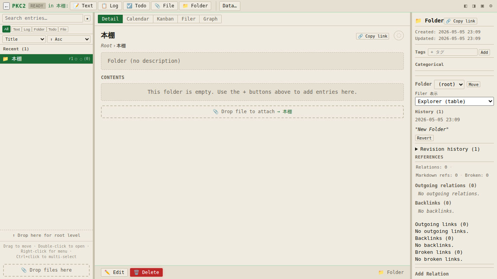
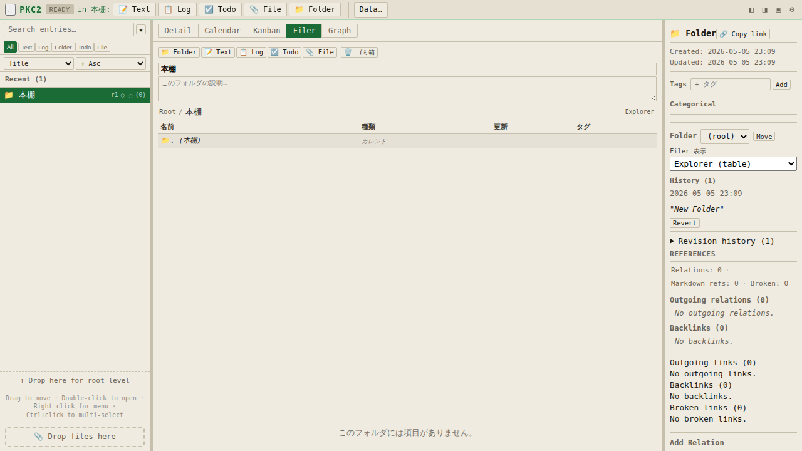
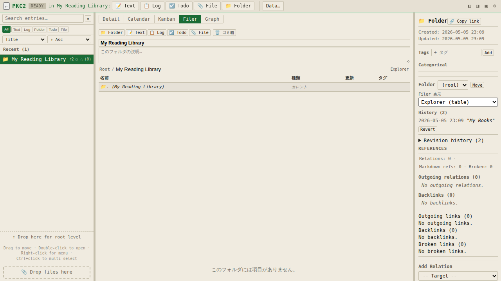
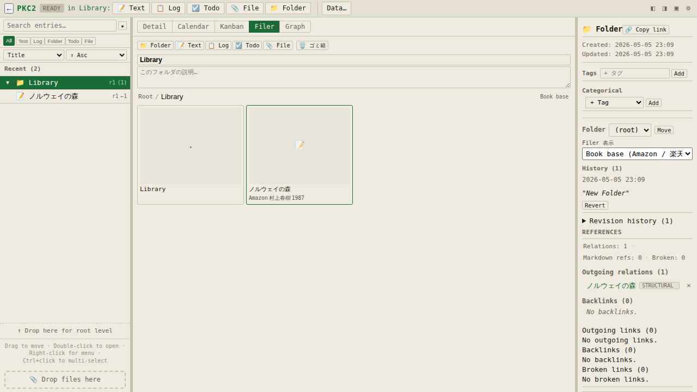
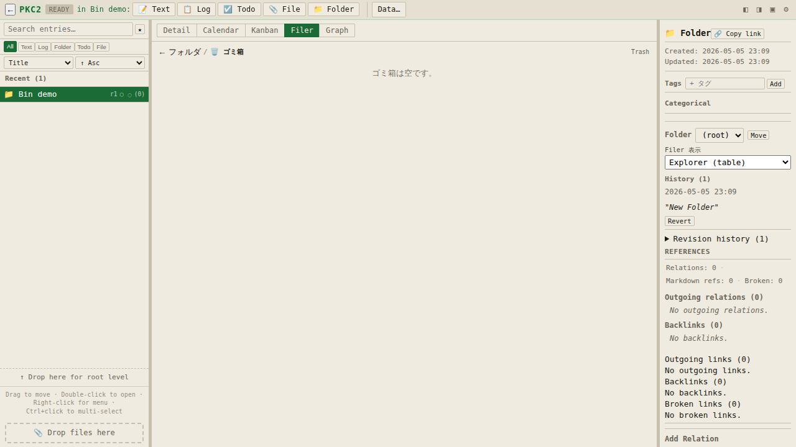
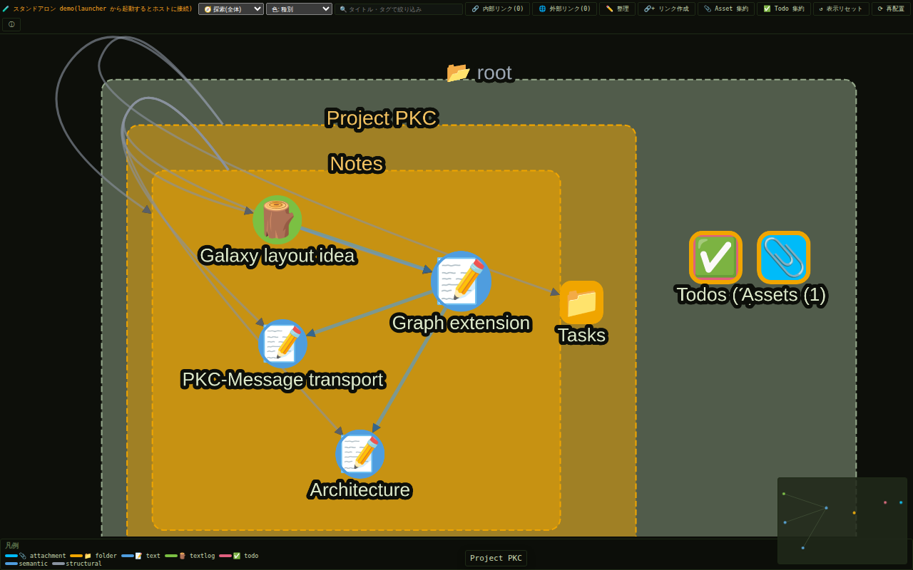
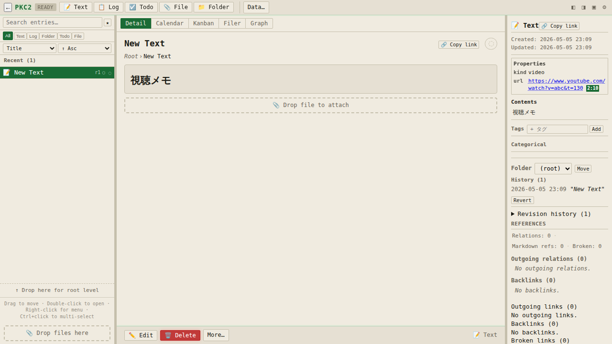
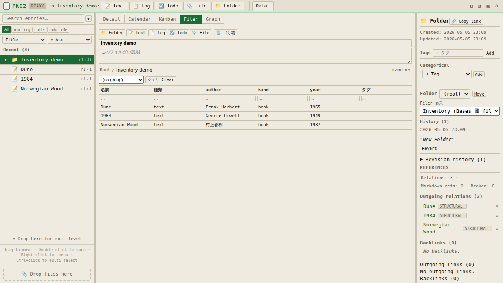
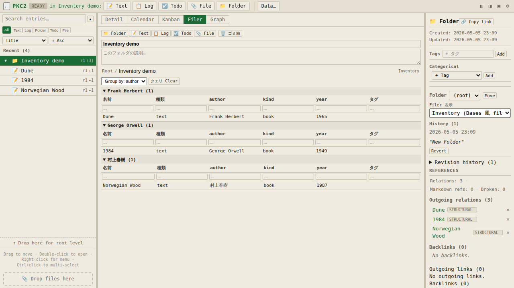

# 10 ファイラビュー / グラフ拡張 / インベントリ

PKC2 v2.3 から、センターペインの表示タブが **5 種類** になりました。Detail / Calendar / Kanban に加えて **Filer**(ファイラ)と **Launcher**(ランチャー)が独立タブとして並びます。



> **Graph について(2026-06 更新)**: 以前センターペインの第 5 タブだった Graph ビューは、**独立した「グラフ拡張」(別ウィンドウで動く単一 HTML)** に生まれ変わりました。本体からは切り離されたため、使いたい人だけが取り込んで起動するオプトイン機能です(§10.2)。

新しいタブと、それを支える機能群(frontmatter / fragment / bookmarklet 取込 / 画像 PiP プレビュー)はすべて **既存の 5 archetype**(TEXT / TEXTLOG / TODO / ATTACHMENT / FOLDER)と TAG / RELATION の組み合わせで動作します。新しい archetype を覚える必要はありません。

### v2.3.0 Wave Z で変わった点(2026-05-16)

**左ペインとファイラの並び替えが多階層に対応** しました。従来は title / created_at / updated_at で **1 階層 flat sort** していたため、フォルダ・テキスト・添付画像が混在して並んでいました。v2.3.0 では各階層内で **フォルダを先頭に grouping し、その後に他のエントリを並べる + 階層構造を保ったまま再帰的に並び替える** ように改善しました。

具体例:本マニュアル(`pkc2-manual.html`)を開くと、左ペインで「はじめに / 基本操作 / 保存と持ち出し / 付録 / 見本 / **ASSETS**」のフォルダが先頭に並び、その中に章エントリ(`01_はじめに` `02_クイックスタート` …)が章番号順に整列します。本文中で参照されている画像 attachment は新設の **ASSETS フォルダ** にまとめられ、章エントリの間に散在しません。

各フォルダ内の並び順は、画面上部のソート切替(title / created / updated / manual)に従って各階層内で適用されます。manual モードでは `container.meta.entry_order` に保存した手動順序が尊重されます。

---

## 10.1 Filer ビュー — 俯瞰的なエントリ操作と閲覧

Filer は「フォルダの中身を一覧する場所」です。テーブル / 画像グリッド / カードグリッド / グラフ / インベントリの 5 つの **subset profile** を folder ごとに切替えられます。

### 10.1.1 Explorer subset(default、テーブル表示)

folder を選んで Filer タブを click すると、folder の中身が **テーブル** で表示されます。



行をクリックすると entry が選択され、folder ならその場で scope が切替わり、それ以外の archetype なら Detail ビューへ遷移します。テーブル先頭の `.` 行は現在のフォルダ自身、`..` 行は親フォルダ(root では非表示)で、Unix ライクなナビゲーションが可能です。

### 10.1.2 フォルダ名 + 説明をその場で編集

Filer ヘッダ内で folder の **名前変更** と **説明文** を直接編集できます。テキスト欄から離れると即座に保存されます。



### 10.1.3 subset 切替 — Book base / Video base / Novel base

メタペインの「Filer 表示」ドロップダウンで subset profile を切替えると、folder 内の TEXT entry を **frontmatter `kind:`** または **本文中の URL ホスト** で自動分類して **カードグリッド** で表示します。

例:`kind: book` の TEXT entry を `Book base` 表示にすると、表紙画像 + 著者 + 出版年 + 評価 のフィールドが card として並びます。



対応プロバイダ(URL ホスト判定):
- **Book base**: Amazon / 楽天ブックス / honto / 紀伊國屋 / OpenBD / 読書メーター / Google Books
- **Video base**: YouTube / niconico / Vimeo / Twitch / bilibili
- **Novel base**: 小説家になろう / カクヨム / pixiv 小説 / 青空文庫 / Wattpad

### 10.1.4 Contact sheet(album)/ Inventory

| subset | 用途 | 内容 |
|---|---|---|
| Contact sheet | 画像 attachment 主体 folder | サムネイル grid + キャプション |
| Inventory | Bases 風クエリ | 動的 column / 行ごと filter / column ヘッダで sort / Group by |

> Note: かつての filer 内 Graph subset は廃止されました。古い container に `kind: graph` の表示設定が残っていてもエラーにはならず、Explorer テーブル表示に静かにフォールバックします。関係性の可視化は **グラフ拡張**(§10.2)を使ってください。

### 10.1.5 Trash(ゴミ箱)を Filer で開く

Filer ヘッダの 🗑️ ゴミ箱 ボタン → 削除済みエントリの一覧が表示されます。各行の **復元** ボタンで戻せます。



### 10.1.6 「.」と「..」のナビゲーション

すべての subset の先頭に **`.` 行(現在の folder)**、その下に **`..` 行(親 folder)** が並びます。`..` をクリックすると 1 階層上に上がります。`..` 行は drop target でもあり、子 entry をドロップすると親 folder に移動します。

> root 階層では `..` は表示されません。

---

## 10.2 グラフ拡張 — 別ウィンドウで動く関係性可視化

グラフは **PKC-Extension(拡張)** として提供されます。単一 HTML ファイル(`pkc2-graph.html`)を PKC2 に取り込み、拡張として起動すると、**別ウィンドウ**で container 全体の関係ネットワークが表示されます。本体とはメッセージ(postMessage)だけで通信し、エントリの **index / 関係 / リンク統計** だけが渡ります — 本文やアセットの中身は渡りません。



### 10.2.1 導入と起動

1. `pkc2-graph.html` を PKC2 にドラッグ&ドロップして取り込む
2. 取り込んだ attachment を選択し、カード内の「**PKC-Extension として扱う**」チェックを ON にする
3. そのまま「**スタートアップ起動**」も ON にすると、PKC2 を開くたびに自動で立ち上がります(ブラウザがポップアップをブロックした場合は画面右下にリトライ用のボタンが出ます)
4. 起動は attachment カードの「🌐 Open in New Window」、または Launcher タブのタイルから

> **困ったとき**: 拡張が原因で起動が固まる場合は、URL に `?pkc-safe-mode=1` を付けて開くと自動起動がスキップされます。

> **サンドボックス実行(2026-06 更新)**: 拡張は既定で**サンドボックス内**(隔離された iframe)で実行されます。拡張からホストの保存データや画面には触れず、通信はメッセージ経由のみです。詳しくは [13 章 §13.1.5](13_アプリランチャーと出力機能.md) を参照。

### 10.2.2 何ができるか

- **4 つのビュー**: 🧭 探索(全体)/ 📁 フォルダ整理(compound 箱)/ 🔗 つながり / 🕒 時系列
- **5 つの色分け軸**: 種別 / カラータグ / タグ / フォルダ深さ / クラスタ(自動コミュニティ検出)
- **検索**: タイトル・タグで live 絞り込み(レイアウトは動かさずハイライト)
- **内部リンク / 外部リンク**: 本文中のエントリ参照(`entry:` リンク)を辺として表示、外部 URL はドメイン別に集約したノードで表示
- **集約**: attachment / todo を 1 ノードにまとめて俯瞰(クリックで展開)
- **ミニマップ**: 右下に全体図 + 現在の表示範囲の矩形。クリックでその位置へパン

### 10.2.3 PKC2 本体との同期

- グラフでノードを **クリック** → PKC2 側でそのエントリが選択されます
- **ダブルクリック** → PKC2 側で開いて前面化します
- PKC2 側で選択を変えると、グラフがそのノードへ **フォーカス移動** します(フォルダを選ぶとそのフォルダのサブツリー表示に)
- 「✏️ 整理」モードでノードをフォルダ箱へドラッグ → **フォルダ移動**、「🔗+ リンク作成」モードでノード間をドラッグ → **関連(semantic relation)作成**。どちらも PKC2 本体が内容を検証してから適用するので、グラフ側の操作でデータが壊れることはありません
- container を編集すると、開いているグラフへ**自動で反映**されます(配置は崩れません。並べ直したいときは「⟳ 再配置」)

### 10.2.4 スタンドアロン demo

`pkc2-graph.html` を単体でブラウザに開くと、ホスト接続なしの **demo モード**(サンプルデータ)で動きます。動作確認に便利です。

---

## 10.3 Frontmatter — エントリの固有プロパティ

TEXT entry の本文先頭に `---` で挟んだ YAML 風ブロックを書くと、メタペインの **Properties** カードに表示されます。`url` フィールドは clickable リンクになり、URL に fragment(YouTube `?t=` / PDF `#page=` 等)が含まれる場合は **🔵 fragment badge** が付きます。

```yaml
---
kind: video
url: https://www.youtube.com/watch?v=abc&t=130
---
# 視聴メモ
```



サポートする型:string / number / boolean / null / 配列(`[a, b, c]` / 行頭 `- a`)/ ISO 日付文字列。

> frontmatter は markdown 描画から自動的に除外されます — render される本文は `---` ブロック以降だけです。

---

## 10.4 Inventory subset — Bases 風 query view

folder 内 entry を **動的テーブル** で表示し、各 column に filter 入力 / column ヘッダ click で sort / Group by select でグループ化できます。

### 10.4.1 デフォルト(no group)



各 column の filter 入力に文字を打つと substring match で行が絞り込まれます。column ヘッダを click すると ▲(asc)→ ▼(desc)→ off のトグル。

### 10.4.2 Group by(著者ごとなど)

Group by select に column を選ぶと、値ごとに `<details>` セクションでグループ化されます。



> column は frontmatter の key を **動的に集計** して生成。built-in は **名前 / 種類 / タグ**、それ以外は entry が持つ frontmatter の和集合。Bases 風の named view 保存は次の wave で予定。

---

## 10.5 画像プレビュー(PiP / 別ウィンドウ)

Filer の Contact sheet で画像 attachment の card を click すると、**Document Picture-in-Picture** または **新規ウィンドウ** で画像が開きます(メインシェルにモーダルは出さない方針)。

ツールバー:
- 「画面内フィット」「等倍 (1:1)」ボタン
- プリセット 25/50/75/100/150/200/400% プルダウン
- 🔗 Copy link
- ✕ close

> Document PiP 対応は Chrome / Edge 116+。それ以外は新規ウィンドウで同等の UI が出ます。

---

## 10.6 Bookmarklet で外部サイトから取込

ブラウザのブックマークレットを使えば、Amazon / YouTube / 小説家になろう などのサイトから **新しい TEXT entry を直接作成** できます。

### 10.6.1 仕組み

1. bookmarklet が現在のページ情報を JSON 化
2. base64 エンコードして PKC2 を新タブで起動(`?pkc-snapshot=<base64>`)
3. PKC2 が boot 時に検出 → frontmatter + body 入りの TEXT entry を auto-create
4. URL から取込パラメータが除去され、リロードで重複しない

### 10.6.2 サンプルブックマークレット

ブックマークバーに登録するだけで使えます。`PKC2_URL` を自分の PKC2.html の URL に置き換えてください。

```javascript
javascript:(function(){
  var PKC2_URL = 'https://your-pkc2.example.com/pkc2.html';
  var v = document.querySelector('video');
  var t = v ? Math.floor(v.currentTime) : 0;
  var url = location.href.split('&t=')[0] + '&t=' + t;
  var snap = {
    format: 'pkc2-fragment-snapshot', version: 1,
    fragment: {
      source: location.href,
      locator_kind: 'time',
      locator: { kind: 'time', start_sec: t },
      open_uri: url,
      label: Math.floor(t/60) + ':' + ('0' + (t%60)).slice(-2)
    },
    selection: { title: document.title, url: url },
    captured_at: new Date().toISOString()
  };
  var b64 = btoa(unescape(encodeURIComponent(JSON.stringify(snap))));
  window.open(PKC2_URL + '?pkc-snapshot=' + b64, '_blank');
})();
```

YouTube / Amazon / 小説家になろう / W3C Text Fragment / 汎用 の 5 種が用意されています。詳細は `docs/development/bookmarklet-snapshot-recipes-2026-05.md` 参照。

---

## 10.7 サイドバーをファイラモードに

Tier 0 flag `sidebar.mode = filer` を有効にすると、左ペインが「現在の folder の compact filer」に切替わります。`..` 行で親フォルダへナビゲートできるエクスプローラ風 UI です。

URL 起動例:
```
pkc2.html?pkc-flag=sidebar.mode=filer
```

---

## 10.8 フォルダの detail を Filer に統合(opt-in)

Tier 0 flag `folder.detail_as_filer = true` で、folder を選択した時の detail ビューが自動的に **Filer 表示** になります。folder 専用の detail UI は実質的に廃止になり、ファイラの高機能 UI が folder の default になります。

URL 起動例:
```
pkc2.html?pkc-flag=folder.detail_as_filer=true
```

> default OFF 段階の opt-in 機能。安定後に default ON へ切替予定。

---

## 10.9 関連する章

- エントリの種類について → [04 エントリの種類](04_エントリの種類.md)
- 編集・タグ・関連付け → [05 日常操作](05_日常操作.md)
- フォルダのエクスポート(任意 archetype + asset 同梱)→ [07 保存と持ち出し](07_保存と持ち出し.md)
- 困ったとき → [09 トラブルシューティングと用語集](09_トラブルシューティングと用語集.md)
