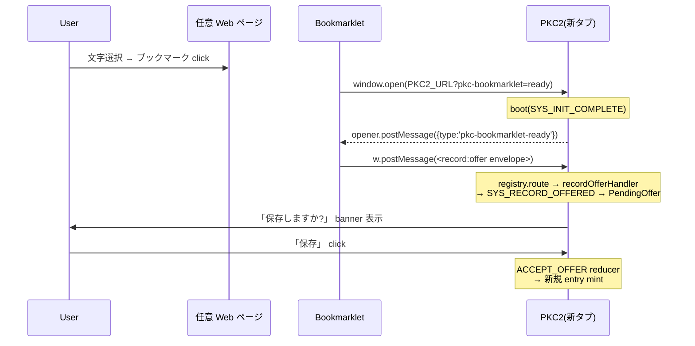

# 11 Bookmarklet サンプル — PKC-Message v1 を外部から叩く

このページは **PKC-Message v1 spec を外部 sender 側から実装する初の公式サンプル**です。Web ページから PKC2 へ「選択したテキストを新エントリとして提案する」 bookmarklet を題材に、envelope の組み立て・handshake・user-consent gate までを逐行解説します。Extension / 別アプリ / OS launcher などから PKC2 に書き込みたい開発者の入門教材として使えます。

## 1. 何を作るか

ブックマークバーに 1 個だけ置く JavaScript bookmarklet。任意の Web ページで click すると:

1. 新タブで PKC2 が起動
2. PKC2 の右上に「**保存しますか?**」の PendingOffer banner が出る
3. user が「保存」を click した時に **初めて** entry が作成される

「読んでる Web ページの引用を、ワンクリックで PKC2 に提案する」UX。

## 2. なぜ PKC-Message 経由なのか

URL query で payload を渡す方法(例:`?pkc-snapshot=<base64>`)はシンプルですが、以下のリスクがあります:

| Risk | URL query | postMessage |
|---|---|---|
| URL に payload 露出 | アドレスバー / 履歴 / Referrer / server log に残る | 出ない |
| URL 長制限 | ~2000 chars(IE 互換) | 無制限 |
| user-consent gate | bypass しがち(URL 入った瞬間に処理) | spec で必須 |
| origin 検証 | 不可能 | spec § 3.3 で明示 |

PKC-Message v1 は postMessage を transport としており、payload は **URL に乗らない**・**user-consent gate を強制**・**envelope shape で structural validate** という 3 つの安全装置を持ちます。

→ 詳細は `docs/spec/pkc-message-api-v1.md` を参照。

## 3. Bookmarklet の動作シーケンス



## 4. PKC-Message envelope の構造

PR-S で送る envelope は spec §4.1 の `MessageEnvelope` 完全準拠:

```js
{
  protocol: 'pkc-message',           // §4.1 必須(literal)
  version: 1,                         // §4.1 必須(現状 v1 のみ受理)
  type: 'record:offer',              // §7.2 既存 type、KNOWN_TYPES に登録済み
  source_id: 'extension:pkc2-bookmarklet@1.0',  // sender ID(自由)
  target_id: null,                   // broadcast(receiver 全員)
  payload: {
    title: '<page title>',           // §7.2 必須
    body: '<frontmatter + 本文>',     // §7.2 必須
    source_url: '<location.href>',    // §7.2.4 capture profile
    captured_at: '<ISO 8601>'         // §7.2.4
  },
  timestamp: '<ISO 8601>'            // §4.1 必須
}
```

各 field のルール:

- `protocol === 'pkc-message'` 以外は `WRONG_PROTOCOL` で reject(spec §4.3)
- `version !== 1` は `WRONG_VERSION` で reject
- `type` が `KNOWN_TYPES` 未登録なら `INVALID_TYPE` で reject
- `payload.title` / `payload.body` は string 必須(`recordOfferHandler` が `validateOfferPayload` で structural check)

## 5. 完全 Bookmarklet コード

ブックマークバーへドラッグして使える 1 行 `javascript:` URI(改行・コメントなし圧縮版):

```js
javascript:(function(){var s=getSelection().toString().trim(),now=new Date().toISOString(),t=document.title||"Snapshot",b="---\nurl: "+location.href+"\ncaptured_at: "+now+"\n---\n\n# "+t+"\n\n"+s,env={protocol:"pkc-message",version:1,type:"record:offer",source_id:"extension:pkc2-bookmarklet@1.0",target_id:null,payload:{title:t.slice(0,200),body:b,source_url:location.href,captured_at:now},timestamp:now},w=open("https://sm06224.github.io/PKC-Public/PKC2/?pkc-bookmarklet=ready","_blank");if(!w){alert("PKC2: popup blocked");return;}function h(e){if(e.source!==w)return;if(e.data&&e.data.type==="pkc-bookmarklet-ready"){w.postMessage(env,"*");removeEventListener("message",h);}}addEventListener("message",h);})();
```

PKC2 の `⚙ → Menu → Bookmarklet` の「📌 Send to PKC2」をブックマークバーへドラッグすると同じものが手に入ります。生成元 instance の URL が自動で埋め込まれるので、PKC2-DEV から取れば PKC2-DEV へ、stable から取れば stable へ届きます。

### 読みやすい展開版(コメント付き)

```js
(function () {
  // 1. 現在ページから snapshot 材料を採集
  var s = getSelection().toString().trim();
  var now = new Date().toISOString();
  var t = document.title || 'Snapshot';

  // 2. body には frontmatter + 本文。後で `recordOfferHandler` が
  //    `injectCaptureHeader` で provenance blockquote を上書き付与する
  //    ので、ここでは生 markdown のままで OK。
  var b = '---\n'
        + 'url: ' + location.href + '\n'
        + 'captured_at: ' + now + '\n'
        + '---\n\n'
        + '# ' + t + '\n\n'
        + s;

  // 3. PKC-Message v1 envelope を組み立て
  var env = {
    protocol: 'pkc-message',
    version: 1,
    type: 'record:offer',
    source_id: 'extension:pkc2-bookmarklet@1.0',
    target_id: null,
    payload: {
      title: t.slice(0, 200),
      body: b,
      source_url: location.href,
      captured_at: now,
    },
    timestamp: now,
  };

  // 4. PKC2 を新タブで起動(?pkc-bookmarklet=ready で one-shot listener
  //    を install させる signal)
  var w = window.open(
    'https://sm06224.github.io/PKC-Public/PKC2/?pkc-bookmarklet=ready',
    '_blank',
  );
  if (!w) {
    alert('PKC2: popup blocked');
    return;
  }

  // 5. PKC2 boot 完了の合図(`pkc-bookmarklet-ready`)を待って envelope 送信。
  //    e.source 比較で「自分が開いたタブからの message か」を確認
  //    (他のタブの postMessage には反応しない)
  function h(e) {
    if (e.source !== w) return;
    if (e.data && e.data.type === 'pkc-bookmarklet-ready') {
      w.postMessage(env, '*');
      window.removeEventListener('message', h);
    }
  }
  window.addEventListener('message', h);
})();
```

## 6. PKC2 側の受信パス

`src/main.ts` の boot path で `installBookmarkletPkcMessageBridge(dispatcher, registry)` が呼ばれます:

1. URL に `?pkc-bookmarklet=ready` が無ければ即 return(通常起動には影響しない)
2. URL flag を `history.replaceState` で消す(reload で再走しない)
3. one-shot `'message'` listener を install:
   - source / data shape を validate(`protocol` / `version` / `type` / `timestamp` の 4 段 check)
   - validate 通れば `registry.route(...)` で **既存の `recordOfferHandler`** を invoke
   - 1 件処理したら listener 自動 remove
4. `window.opener` に `postMessage({type:'pkc-bookmarklet-ready'}, '*')` を送って handshake 開始
5. 30 秒 timeout で listener 自動 remove(stuck な flow を放置しない)

`recordOfferHandler` は `validateOfferPayload` で payload を structural check し、PendingOffer を AppState に積む → renderer が banner 表示 → user の「保存」 click で `ACCEPT_OFFER` reducer が走り **初めて entry が作成される**。

## 7. user-consent gate の重要性

PKC-Message v1 spec §6.2 は **「sender が host に書き込める唯一の経路は `record:offer`」かつ「user の同意 UI なしで自動 accept は v1 では存在しない」** と固定しています。

これにより bookmarklet は:

- **silently に entry を作れない**(必ず PendingOffer banner で user 確認)
- **既存 entry を上書き / 削除できない**(spec §6.2 で write 範囲を新規 entry のみに制限)
- **container 全体を読み取れない**(spec §6.1 で read 範囲も限定)

URL flag を仕込まれて偽の bookmarklet click を user が踏んでも、最悪のケースが「PendingOffer banner を 1 件 user に見せるだけ」(storage write なし)で済む設計。

## 8. 拡張アイデア

- **archetype 切替**:`payload.archetype: 'todo'` で送れば todo として提案できる(`recordOfferHandler` が archetype を解釈する)
- **タグ自動付与**:body に `tags: [research, web]` の frontmatter を入れる(`ACCEPT_OFFER` reducer 後に user が編集できる)
- **複数選択取込**:`document.getSelection()` の各 Range を別々の payload にして連続 postMessage(各 envelope は独立した PendingOffer に積まれる)
- **画像も同梱**:`payload.body` に `` を埋め込めば markdown 経由で画像も取込可能(ただし base64 data URL は body サイズ cap §9.3 注意)
- **別 archetype の sender 例**:Chrome / Firefox / Safari 拡張機能の content script から同じ envelope を送れば、bookmarklet と完全互換に動作する。**`source_id` を `'extension:my-clipper@2.0'` に変えるだけで本格的な web clipper 拡張に発展できる**

## 9. Troubleshooting

| 症状 | 原因 | 対処 |
|---|---|---|
| 新タブが開かない | popup blocker | ブラウザの popup 設定で PKC2 origin を許可 |
| タブは開くが PendingOffer 出ない | envelope の `protocol` / `version` 不一致 | DevTools console で `WRONG_PROTOCOL` / `WRONG_VERSION` warn を確認 |
| タブは開くが 30 秒経っても何も起きない | `?pkc-bookmarklet=ready` flag が PKC2 boot 前に剥がれた | flag は boot 後に install される、URL に直接 flag を入れて手動 reload して試す |
| `INVALID_TYPE` warn が出る | `type` が `'record:offer'` 以外、または typo | type 名を確認、`KNOWN_TYPES` は spec §7 を参照 |
| user が「保存」 click しても entry にならない | `validateOfferPayload` で reject(`title` / `body` が string でない等) | DevTools console で `[PKC2] record:offer rejected: invalid payload` を確認、payload shape を spec §7.2 に合わせる |
| body 全体が消失している | body size cap(spec §9.3、現状 ~512 KB)超え | 長文記事は selection を短くするか、画像 base64 を含めない |

## 10. 関連 spec / 実装 ref

- **spec**: `docs/spec/pkc-message-api-v1.md` — envelope §4 / capability §5 / record:offer §7.2 / 漏洩防止 §6.3 / **§9.2.1 v1.1 capture profile additive**
- **profile**: `docs/spec/record-offer-capture-profile.md` — frontmatter blockquote injection §10.4 / 9.x security / **§8.6 v1.1 additive fields**
- **PKC2 実装**:
  - `src/adapter/transport/message-bridge.ts` — bridge mount + origin allowlist
  - `src/adapter/transport/record-offer-handler.ts` — `validateOfferPayload`(v1.1 fields 含む)+ PendingOffer flow
  - `src/main.ts` の `installBookmarkletPkcMessageBridge` — bookmarklet 専用の one-shot listener
  - `src/adapter/state/app-state.ts` の `injectCaptureFrontmatter` — v1.1 frontmatter 自動生成
  - `src/features/filer/auto-display-profile.ts` — `kind:` / mime → Bases subset 自動判定
- **PKC2 PR ref**: PR #295 (S) ad-hoc 独自 type → spec 準拠、PR #297 (U) v1.1 capture profile、PR #298 (V) page-open UX + 5 公式 site scraper、PR #299 (W) custom template editor、PR #300 (X) mime + thumbnail 描画統合

---

## 11. 5 公式サイトでの実例

PR-V(PR #298)で **5 公式 site の URL host pattern** が bookmarklet に inline されており、各サイトで click すると自動的に kind / provider / thumbnail が決まります。

### 11.1 YouTube

```
URL: https://www.youtube.com/watch?v=dQw4w9WgXcQ
→ kind: video
→ provider: YouTube
→ thumbnail_url: https://i.ytimg.com/vi/dQw4w9WgXcQ/maxresdefault.jpg
                 (URL から videoID を regex 抽出して maxres を組み立て)
```

`<meta property="og:image">` も拾えるが、YouTube の og:image は中解像度。bookmarklet は **直接 maxresdefault.jpg を使う** ことで card grid で 1280×720 の高画質 thumbnail を表示。

### 11.2 niconico

```
URL: https://www.nicovideo.jp/watch/sm9
→ kind: video
→ provider: niconico
→ thumbnail_url: og:image(nicovideo の standard thumbnail)
```

niconico は og:image が標準的なので bookmarklet は素直に拾うだけ。

### 11.3 小説家になろう

```
URL: https://ncode.syosetu.com/n2267be/
→ kind: novel
→ provider: 小説家になろう
→ thumbnail_url: og:image(なろう作品 cover、無い作品もあり)
```

`(www|ncode|novel18|mypage).syosetu.com` の sub-domain も同 provider として扱う。R-18 サイト(novel18)も同等(user 自身の閲覧前提)。

### 11.4 カクヨム

```
URL: https://kakuyomu.jp/works/16817330650681500611
→ kind: novel
→ provider: カクヨム
→ thumbnail_url: og:image(KADOKAWA 系の標準 og)
```

### 11.5 Amazon

```
URL: https://www.amazon.co.jp/dp/B0xxxxxxxx
→ kind: book
→ provider: Amazon
→ thumbnail_url: og:image(書影、商品ページの大画像)
```

`amazon.co.jp` / `.com` / `.co.uk` / `.de` / `.fr` / `.es` / `.it` の各 TLD に対応。Kindle 本も紙書籍も同等(`kind: book`)。書影が provider 側で長期 stable なので URL 保存で十分。

### 11.6 公式 5 site の Bases 化フロー(全体図)

```
[YouTube ページ]
      ↓ ブックマーク click
[bookmarklet が page metadata 採集]
  - kind: video
  - thumbnail_url: ...maxresdefault.jpg
  - provider: YouTube
      ↓ window.open(PKC2?pkc-bookmarklet=ready)
[PKC2 boot + handshake]
  - opener.postMessage("ready")
      ↓ bookmarklet → w.postMessage(record:offer envelope)
[recordOfferHandler]
  - validateOfferPayload(v1.1 含む)
  - SYS_RECORD_OFFERED → PendingOffer banner
      ↓ user "保存" click
[ACCEPT_OFFER reducer]
  - injectCaptureFrontmatter で entry body 先頭に YAML frontmatter 生成
  - kind / url / thumbnail / provider / captured_at が刻まれる
      ↓
[entry が container に追加]
      ↓ filer view を開く(同じ folder に YouTube entry が 7 件以上)
[autoDetectFilerProfile]
  - 7 割多数決 → kind:'video' が >= 70%
  - folder の display_profile を 'video-base' として render
      ↓
[card grid 描画]
  - pickImageAssetForEntry が frontmatter.thumbnail を読み
  -  で表示
      ↓
[user 視点]
  「Bases 風 video カードグリッド、YouTube thumbnail が並ぶ」
```

## 12. 自前ローカルアセットの位置づけ

bookmarklet 経路と **同じ Bases UX に集約** することが PR-X(PR #300)の目的。

### 12.1 attachment 経由(drag-drop)

PKC2 の attachment archetype は body に `{ name, mime, asset_key }` を JSON 化して持ち、`container.assets[asset_key]` に base64 を格納します。`autoDetectFilerProfile` が **mime を読み取って** kind を即決:

| MIME | 自動 category | folder 中身 7 割 → subset |
|---|---|---|
| `image/png`, `image/jpeg`, `image/gif`, `image/webp`, ... | image | contact-sheet(album)|
| `audio/mpeg`(MP3), `audio/wav`, `audio/ogg`, ... | audio | audio-base |
| `video/mp4`, `video/webm`, `video/quicktime` | video | video-base |
| `application/pdf` | book | book-base |
| `application/epub+zip` | book | book-base(将来 reader 連携) |

#### 操作:

1. PC のフォルダから `.mp3` を 7 ファイル以上 drag → PKC2 の folder を target に drop
2. PKC2 が attachment entry を 7 件作成(`mime: audio/mpeg`)
3. folder の filer 表示を開く → autoDetect が 87.5% > 70% → **audio-base subset** に切替
4. card grid で audio file 一覧(現状 thumbnail なし、各 entry を click → detail で再生)

mp4 / pdf / epub も同様。**外部 URL 経路(YouTube)とローカル経路(MP4)が同じ folder に混在しても OK** — 両方とも `kind: video` / `mime: video/*` で video-base に集約されます。

### 12.2 アルバム(image folder)

複数の画像 attachment を 1 folder にまとめると、autoDetect が 100% image → contact-sheet subset(gap=0、caption overlay 反転、サムネ右下 / G12 PR-A)で表示。

#### 操作:

1. 自炊画像 / 旅行写真 を folder に drag
2. filer auto detect → contact-sheet(album)
3. ギャップ無しのモザイク表示で一覧

### 12.3 ZIP まとめ(自炊本 / 写真集)

ZIP を直接 attachment にすると `application/zip` で **other 扱い**(filer 単独表示には乗らない)。**folder 配下に展開してから集約する** のが PKC2 流儀:

#### 推奨フロー:

1. ZIP 内の画像を OS / 別アプリで一旦展開
2. PKC2 で folder を作成
3. その folder に展開された画像を drag(複数選択 drop)
4. folder 中身が image 100% → contact-sheet で表示

将来 wave で「ZIP を folder + 子 attachment に自動展開する import 経路」を検討余地あり(PKC2 の単一 HTML 哲学を破らないために慎重に)。

### 12.4 epub の将来計画

epub は `application/epub+zip` で **kind: 'book'** に classify 済(PR-X)。現状 reader UI は無いので detail view で attachment download する形ですが、将来 wave で:

- **epub reader を埋め込み**(epub.js 等の vanilla TS port、PKC2 dep 0 を維持できるか要検討)
- attachment archetype + epub mime の entry を click → reader UI が起動
- 章移動 / 栞 / 検索 / annotation を PKC2 内で完結

epub 取込の bookmarklet 連携(青空文庫 等から epub を直接 capture)も将来 wave。

---

## 13. PR-U〜X の連携で実現される統合像

| 経路 | 入口 | 中間 | 結果 subset |
|---|---|---|---|
| YouTube ページ → 動画 capture | bookmarklet | record:offer + frontmatter | video-base + thumbnail |
| ローカル MP4 → 動画ファイル取込 | drag-drop | attachment + mime: video/mp4 | video-base |
| 小説家になろう → 連載 capture | bookmarklet | record:offer + frontmatter | novel-base + cover |
| Amazon 書籍ページ → 書影 capture | bookmarklet | record:offer + frontmatter | book-base + 書影 |
| ローカル PDF → 自炊書取込 | drag-drop | attachment + mime: pdf | book-base |
| ローカル epub → 電子書籍取込 | drag-drop | attachment + mime: epub | book-base + (将来)reader |
| 旅行写真 → アルバム化 | drag-drop | folder + 子 attachment(image)| contact-sheet |

**全部が同じ filer Auto(PR-G、7 割多数決)に乗る** ので、user は「とりあえず folder にぶっこんで filer を開けば形が決まる」UX。

外部 sender(別 PKC2 / Extension / OS launcher)も同じ `record:offer` envelope を v1.1 capture profile で送るだけで完全互換に動作。**PKC-Message v1.1 は外部からの取込口として完成**。

---

> **PR-Y 拡張(2026-05-06)**:本章は当初「bookmarklet 1 例の sample」として書きましたが、user feedback を受けて「**外部 web ページ + ローカルアセット + 将来 epub の統合像**」に拡張しました。PR-U / V / W / X / Y を経て、PKC2 の取込 surface は 「アセットの来歴に依らず Bases に集約」という統一像に至っています。

> **本章の位置付け**:`record:offer` は v1 spec で「外部 sender が host に書き込める唯一の経路」(spec §6.2)です。本章 bookmarklet はそれを踏まえた **public sample** であり、Extension / OS launcher / 別 PKC instance などへの応用の出発点です。
