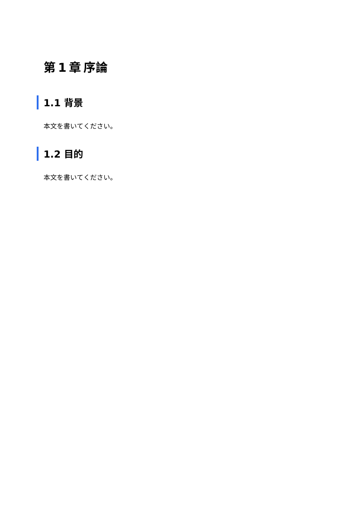
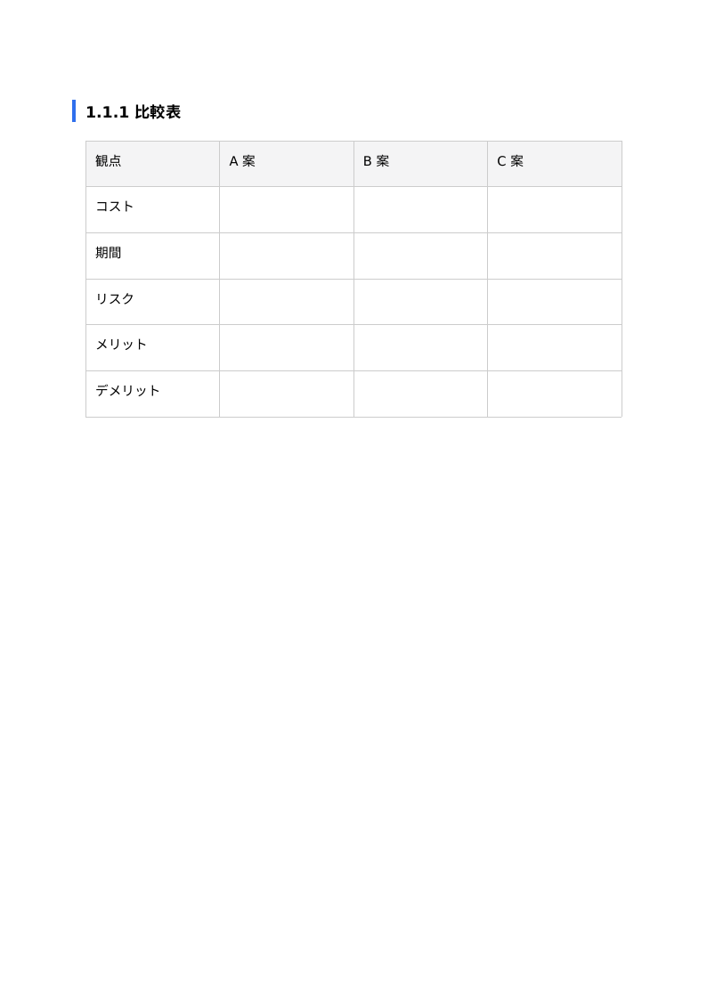
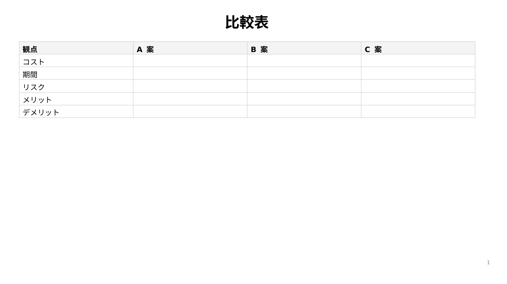
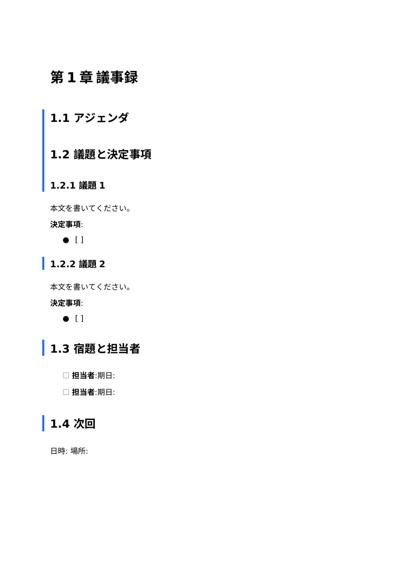
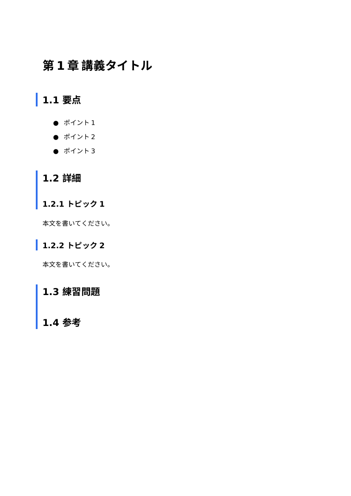
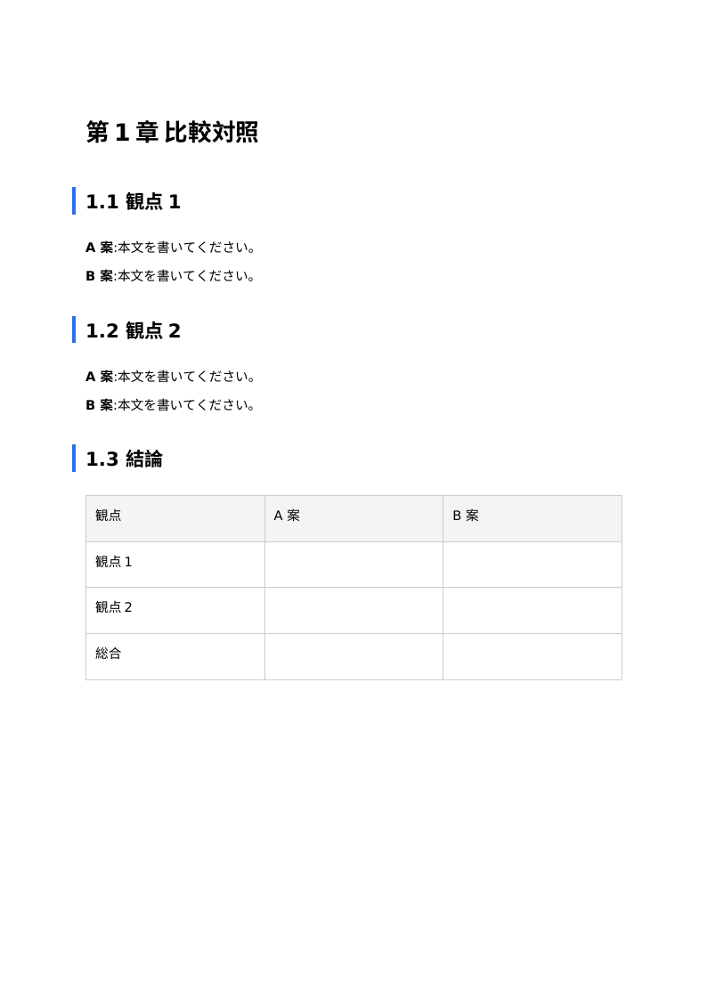
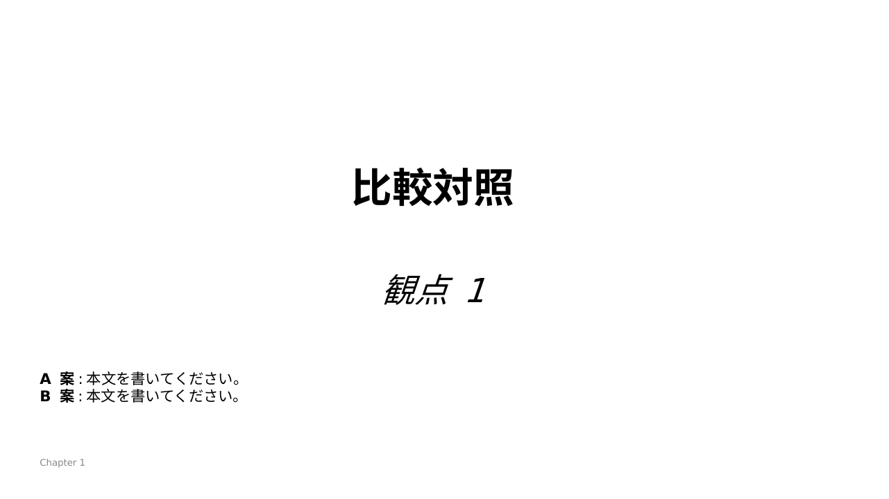
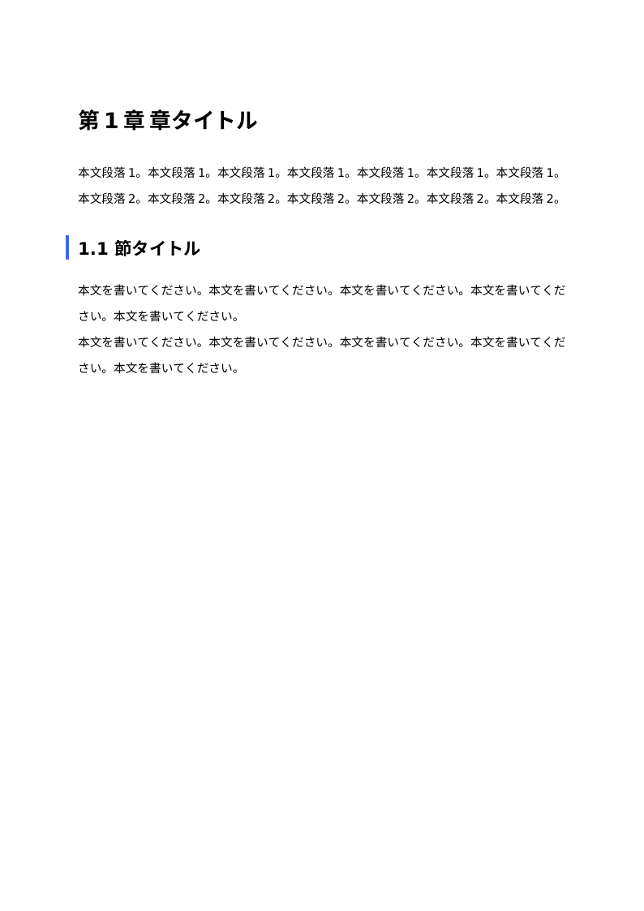
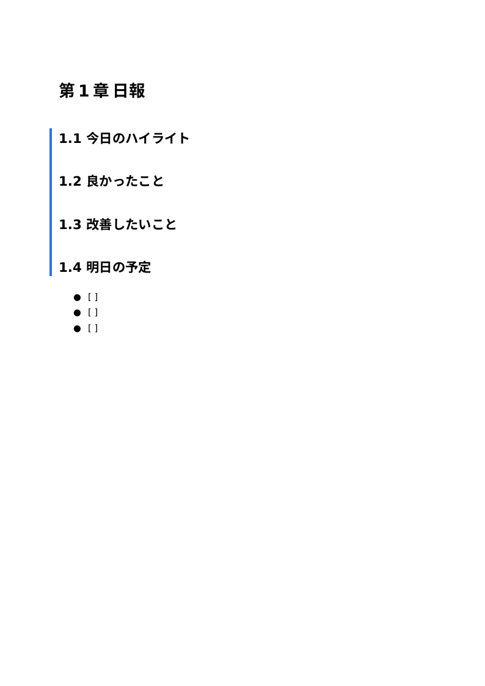

# 14 テンプレートコマンド集

PKC2 の編集中、`/tmpXX` という slash command(XX は半角英数 2 文字)で **template body を一発挿入** できます。本章は PKC2 同梱の **default 14 template** の一覧と、layout 系 8 件の用途 / コードブロック / 実機 docx・pptx レンダリング例を解説します。

## 14.1 使い方

### slash command で挿入

1. TEXT entry / TEXTLOG entry の編集中、エディタ内で `/` を入力
2. slash menu が開き、登録されている template が `/tmpXX — <body 先頭>` として表示される
3. 矢印キーで選び **Enter** で挿入(`/tmpXX` の literal が template body に置換される)

### Flags inspector で追加・編集

template は **Tier 1 flag `templates.entries`** に JSON 形式で保管されます。

```json
{
  "ab": "## 見出し\n\n- 項目 1\n",
  "cd": "別 template の本文\n"
}
```

- key は **半角英数 2 文字**(`[a-z0-9]{2}`)、それ以外は parse 時に silently 落ちる
- value は任意の string、改行は `\n` で escape
- Flags inspector(`?pkc-flags` URL 引数で起動)から JSON 編集可、保存と同時に slash menu に反映

## 14.2 default 14 template の一覧

| key | カテゴリ | 用途 |
|---|---|---|
| `mt` | 軽量 memo | メモ + チェックボックス 1 件 |
| `rt` | 軽量 memo | 振り返り(良かったこと / 改善点) |
| `vd` | 公式 capture | video(YouTube 等) |
| `au` | 公式 capture | audio(podcast 等) |
| `nv` | 公式 capture | novel(小説サイト) |
| `bk` | 公式 capture | book(蔵書) |
| **`rp`** | **layout** | **報告書**(序論 / 本論 / 結論、章節項 auto-numbering) |
| **`pn`** | **layout** | **プレゼン骨子**(扉スライド + 通常スライド + データ表) |
| **`tc`** | **layout** | **表中心**(比較表 1 枚) |
| **`mn`** | **layout** | **議事録**(アジェンダ / 決定事項 / 宿題) |
| **`ln`** | **layout** | **講義ノート**(要点 / 詳細 / 練習問題) |
| **`cp`** | **layout** | **比較対照**(観点別 + 結論表) |
| **`co`** | **layout** | **2 段組レポート**(`layout: a4-2col` frontmatter) |
| **`jl`** | **layout** | **日報**(ハイライト / 振り返り / 明日の予定) |

layout 系 8 件は **Wave X(PR-W6〜W9)で確立した docx / pptx 出力品位**(章番号 auto-numbering、bilingual font stack、accent border、3 layout master、running footer)に最適化された skeleton です。

## 14.3 layout 系 8 件の詳細

各 template について **markdown コード** + **docx page 1** + **pptx slide 1** の実機レンダリングを並べます。docx/pptx 化は **Data… menu → 📝 Word / 🎞 PPT** で 1-click。

---

### 14.3.1 `rp` — 報告書(report)

序論 / 本論 / 結論 の 3 章構成、章節項 auto-numbering(`第1章` / `1.1` / `1.1.1`)+ bilingual font + H2/H3 accent border が効く。

**コード**(`/tmprp` で挿入):

```markdown
---
title:
author:
date:
---

# 序論

## 背景

本文を書いてください。

## 目的

本文を書いてください。

# 本論

## 手法

本文を書いてください。

### 詳細

本文を書いてください。

## 結果

本文を書いてください。

# 結論

本文を書いてください。
```

**docx page 1**:


**pptx slide 1**:


---

### 14.3.2 `pn` — プレゼン骨子(presentation outline)

H1 章 + H2 副題 + H3 通常スライド + データ表の混在 pattern。pptx で 3 layout(扉 / 本文 / 表中心)が自動切替される。

**コード**:

```markdown
---
title:
author:
---

# 導入

## サブタイトル

本文を書いてください。

### 課題と目的

- 課題 1
- 課題 2
- 課題 3

# 本論

### 概要

本文を書いてください。

### データ

| 項目 | 値 |
| --- | --- |
|  |  |
|  |  |

### 詳細

- ポイント 1
- ポイント 2
- ポイント 3

# まとめ

### 振り返りと次のステップ

- 振り返り
- 次のステップ
```


---

### 14.3.3 `tc` — 表中心(table-centric)

5 項目 × 3 案の比較表 1 枚。pptx export で **PKC_TABLE_SLIDE layout** が自動採用され、title 直下から table が開始(上の死に空間撲滅)。

**コード**:

```markdown
### 比較表

| 観点 | A 案 | B 案 | C 案 |
| --- | --- | --- | --- |
| コスト |  |  |  |
| 期間 |  |  |  |
| リスク |  |  |  |
| メリット |  |  |  |
| デメリット |  |  |  |
```




---

### 14.3.4 `mn` — 議事録(meeting minutes)

アジェンダ → 議題と決定事項 → 宿題と担当者 → 次回 の定型構造。**task list**(`- [ ] `)が grey ☐ / green ☑ で色分け、宿題追跡に便利。

**コード**:

```markdown
---
date:
attendees:
---

# 議事録

## アジェンダ

1.
2.
3.

## 議題と決定事項

### 議題 1

本文を書いてください。

**決定事項**:

- [ ]

### 議題 2

本文を書いてください。

**決定事項**:

- [ ]

## 宿題と担当者

- [ ] **担当者**:期日:
- [ ] **担当者**:期日:

## 次回

日時:
場所:
```




---

### 14.3.5 `ln` — 講義ノート(lecture notes)

要点 → 詳細 → 練習問題 → 参考 の 4 ブロック構成。学術用途で章節項 auto-numbering が活きる。

**コード**:

```markdown
---
subject:
date:
---

# 講義タイトル

## 要点

- ポイント 1
- ポイント 2
- ポイント 3

## 詳細

### トピック 1

本文を書いてください。

### トピック 2

本文を書いてください。

## 練習問題

1.
2.
3.

## 参考

-
```




---

### 14.3.6 `cp` — 比較対照(comparison)

観点別 A 案 / B 案 → 結論表 の 2-stage 構造。`**A 案**` / `**B 案**` の bold prefix で項目分離が視認できる。

**コード**:

```markdown
# 比較対照

## 観点 1

**A 案**:本文を書いてください。

**B 案**:本文を書いてください。

## 観点 2

**A 案**:本文を書いてください。

**B 案**:本文を書いてください。

## 結論

| 観点 | A 案 | B 案 |
| --- | --- | --- |
| 観点 1 |  |  |
| 観点 2 |  |  |
| 総合 |  |  |
```




---

### 14.3.7 `co` — 2 段組レポート(2-column layout)

`layout: a4-2col` frontmatter で本文を 2 段組組版(A4 紙、見出し段抜き、column-break-inside avoid)。学会レポート / 紀要に最適。

**コード**:

```markdown
---
layout: a4-2col
title:
author:
---

# 章タイトル

本文段落 1。本文段落 1。本文段落 1。本文段落 1。本文段落 1。本文段落 1。本文段落 1。

本文段落 2。本文段落 2。本文段落 2。本文段落 2。本文段落 2。本文段落 2。本文段落 2。

## 節タイトル

本文を書いてください。本文を書いてください。本文を書いてください。本文を書いてください。本文を書いてください。

本文を書いてください。本文を書いてください。本文を書いてください。本文を書いてください。本文を書いてください。
```




> 注:現状の docx / pptx export は 2 段組組版を直接 mapping しません(HTML render では reform Phase 2 PR-2N で 9 種 layout 対応済)。Word に持っていく場合は手動で「ページ レイアウト → 段組み」で 2 段に変更してください。

---

### 14.3.8 `jl` — 日報(journal)

date / mood frontmatter + 4 セクション(ハイライト / 良かったこと / 改善 / 明日)。継続記入で textlog 化したい場合は **TEXTLOG entry** で同じ template を使うのも可。

**コード**:

```markdown
---
date:
mood:
---

# 日報

## 今日のハイライト

-
-

## 良かったこと

-

## 改善したいこと

-

## 明日の予定

- [ ]
- [ ]
- [ ]
```




---

## 14.4 自前 template の追加方法

### 手順

1. URL に `?pkc-flags` を付けて PKC2 を開く(Flags inspector 起動)
2. category `templates` の `templates.entries` field を編集
3. 既存 JSON object に新 key を追加(2 文字英数 key)

例:`xy` という key で「会議メモ」template を追加する場合:

```json
{
  "mt": "## メモ\n\n- [ ] \n",
  "xy": "## 会議メモ\n\n参加者:\n\n議題:\n\n- \n"
}
```

4. 保存(Flags inspector の Apply / Save ボタン)
5. エディタに戻り、`/` を入力 → `/tmpxy` が候補に現れる

### 注意

- key 衝突は **後勝ち**(同 key を 2 回書くと最後の value が有効)
- key が 2 文字英数規約に違反すると **silently 落ちる**(エラー表示なし)
- value は **literal 挿入**、`{{vars.x}}` 等の変数展開は本機能の対象外(別途 markdown 拡張で対応)

## 14.5 既存 default を上書きしたい場合

`templates.entries` JSON で同じ key を上書きすれば既存 default が置換される。例:`rp`(report)template の構成を変えたい場合、JSON 内で `rp` の value を任意に書き換える。

「default を完全に消したい」場合は value を空文字 `""` にすると挿入時に空 string が挿入される(parse 時には key として残るが本文なし)。

## 14.6 PKC1 から移行する場合

PKC1 にはこの機能がない。PKC2 で初めて使う場合は default の 14 件から始めて、自分の用途に合わせて Flags inspector で増減する運用を推奨。

## 14.7 関連

- 章 12 [マークダウン拡張記法](12_マークダウン拡張記法.md) — `==marker==` / `..em-dot..` / `:::section{role}` 等の PKC 拡張(template 内で使える)
- 章 13 [アプリランチャーと出力機能](13_アプリランチャーと出力機能.md) — docx / pptx 出力経路(本章の template から作った entry を出力)
